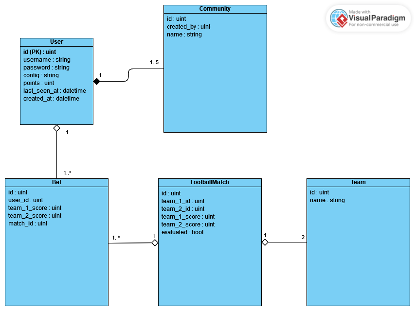

# Bet GenDev CHECK24 Challenge
This project is a simple betting system that allows users to place bets on the outcome of the games of the European Championship 2024.    
It was developed as a part of an application process to the [CHECK24 GenDev Scholarship](https://www.talents.check24.de/gendev).    
All project requirements are described in the [challenge description](https://github.com/check24-scholarships/check24-betting-challenge).

## How to run it on your own machine?

1. `npm install`
2. Create empty database (use either MySQL or SQLite) and configure database either in `.env` file or in `config/app.php`
3. `php artisan migrate` - create tables in a database
4. `php artisan db:seed` - seed database with data (incl. football matches)
5. **either** `npm run dev` - run website as a server with hot reloading
   **or** `npm run build` - build assets and reload page (usually when deploying live)
6. `php artisan key:generate` - generate a key if it is not generated
7. `php artisan config:clear` - clear cached config file
8. `php artisan config:cache` - cache config file
9. `php artisan view:clear` - clear compiled views
10. `php artisan cache:clear` - clear cache

\*steps 6.-9. are optional, just to be sure everything is cleared on a startup

## How to understand what happens in the code?
1. Search for an entering-point of your request into web application in `routes/web.php`.  
   Every route has it's name and *controller* which processes the request.
2. Open controller specified in route selected in previous step and search for a method also specified in routes file.
3. Open view which is returned in the end of a controlled method - in case any view (e.g. `index.blade.php`) is returned.
4. If there is `<livewire:something>`in a view, have a look for a Livewire controller inside `app/Livewire/` directory (in this case it would be `app/Livewire/Something.php`. There could be a lot of logic implemented in a Livewire controller.

## Possible improvements
1. Real-time updates are impleented by using polling by Livewire. That means that requests are being sent every $n$ seconds - even if no data in database were changed. With a lot of active users it will cause heavy load on a database, therefore it would be much more better to use WebSockets. There exists a freshly developed [Laravel Reverb](https://reverb.laravel.com/) - a WebSocket server, which can avoid invefficient polling by Livewire. It works as a push request, only if data in database were changed.
2. Connect to some API, which will update football match score in Live, therefore no admin panel would be needed. Additionally the match duration would be dependent on an API - that means that it's possible that a match can have 1 minute longer pause, finally resulting into 91 minutes long match, but in this system match duration is hardcoded to 90 minutes.
3. Of course there are no borders for developer's creativity to implement a brilliant UI design.

## Technologies used:
- PHP  8.3.6
- [Laravel 11](https://laravel.com/)
    - Laravel Breeze for user authentication
- [Livewire v3](https://livewire.laravel.com/) with [Alpine.js](https://alpinejs.dev/)
- MySQL

## Architecture UML Diagram

## User authentication
Database table: `users`  
Is implemented with use of Laravel Breeze package. Although in requirements stands, that no password is needed (only username is sufficcient to log in) I left it with username:password (by default), as it is not such important part of this project, as betting mechanics is.  
If really only username without password will be needed to login, change `app/Livewire/Forms/LoginForm.php`.

## Communities
Database table: `communities`  
Interaction with communities happens inside `app/Http/Controllers/CommunityController.php`. It is a so-called *resource controller* which provides complete *CRUD* functionality.
Every community has its own leaderboard - described in [Leaderboards](#leaderboards) section.

## Administrators
Users can have `admin` role, which can be verified by `User::hasRole($role)` method.
Roles are defined inside `roles` table.
### Admin panel
In the admin panel (`/admin-panel`) Admins can change score of a currently playing match. Additionally they can add new matches if it is needed.
### Middleware
There exists a `app/Http/Middleware/IsAdmin.php` Middleware, which is used in `routes/web.php` to control access to admin panel.

## Football matches
Football matches are stored inside a `football_matches` table.
Default match duration is assumed to be 90 minutes. Therefore only the `starts_at` attribute is stored and end datetime is calculated as `starts_at->addMinutes(90)`. Possible improvements as mentioned in [Possible improvements](#possible-improvements) section is to have also `ends_at` attribute which could make end datetime flexible.

### Match evaluation
Football match has `evaluated` attribute, which is by default set to false. There is a scheduled command `app:evaluate-football-matches` which evaluates football matches and distributes points to users who bet on a evaluated match.
That command is scheduled to be run every fifteen minutes, but can be also run manually via terminal by `php artisan app:evaluate-football-matches` command.

## Leaderboards
Logic of leaderboards is being calculated insode Livewire component `app/Livewire/Leaderboard.php`. As leaderboard is split/paginated in the "middle", the first part of leaderboard is being stored inside `$users1` and the second part in `$users2`. Additionally two variables are being used to track current pagination status, namely `$limit1` and `$offset2`.
To handle edge cases and/or if leaderboard is fully expanded, variables `$users1Expandable` and `$users2Expandable` are used.

### Community leaderboard
Leaderboard can be used to show users of any community by setting `$communityId`. For example, the leaderboard on a dashboard shows users belonging to Global Standings (`$communityId = 1`), where all users belong to.

### User search
Leaderboard can be used to search for a users inside a community by typing a part of a username into input field on a right above a leaderboard table and either pressing *Enter* key or pressing a search button.
